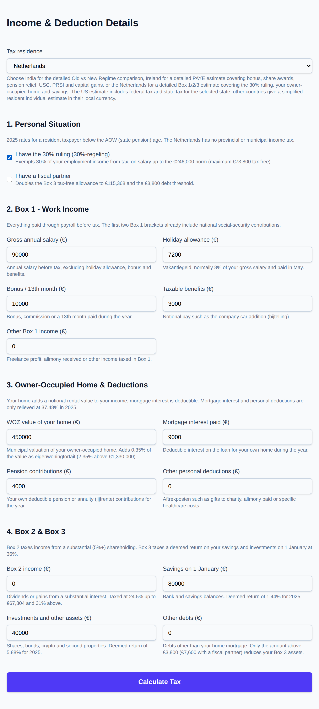

# Tax Break

**Tax Break** is an online individual income tax estimation portal. It supports detailed Indian
Old vs New Regime calculations for the last five financial years (FY 2021-22 to FY 2025-26), plus
resident individual income-tax
estimates for Ireland, the Netherlands, the UK, the US, and Singapore.

🔗 **Live website:** [https://charles2ke.github.io/tax-break/](https://charles2ke.github.io/tax-break/)

> ⚠️ **Disclaimer:** This tool is for **informational and estimation purposes only**. It is **not**
> a substitute for professional tax advice, a chartered accountant, or the official Income Tax
> Department e-filing portal. Always verify your tax computation with a qualified professional or
> the official e-filing utility before filing your return.

## Screenshots

The screenshots below were captured from a local run of the client against the API server, using
sample figures for FY 2025-26. The advance tax, ITR recommendation, save/export and e-filing
features need the backend API, so they are not available on the GitHub Pages demo, which runs the
tax engine directly in the browser.

### Home page


### Income and deduction form


### Form 26AS import (India)


### Old vs New regime comparison


### Detailed breakdown, ITR form and advance tax


### Saved returns, export and simulated e-filing


### Ireland form


### Netherlands form



### Netherlands estimate


### International estimate


## Features

- A guided, step-by-step form: pick your country from prominent country cards, then move through
  the questions with a progress bar, clickable step chips and Back/Next buttons. Every field shows
  an example value and plain-language help, and you can calculate at any point.
- Uploading the Form 26AS text/CSV export (India) to pre-fill salary, interest, dividend and other
  income together with the TDS and challan payments already made. The file is parsed in the
  browser and never leaves your device.
- Assessment Year selection covering the current and previous four financial years (FY 2021-22 to
  FY 2025-26), with slab rates, standard deduction, Section 87A rebate, surcharge and capital gains
  rates for each year encoded as versioned config objects so future years can be added easily.
- Old Regime and New Regime slabs for individuals below 60, senior citizens (60-80), and super
  senior citizens (80+).
- Salary income with HRA exemption calculation per Section 10(13A).
- Income from house property (self-occupied / let-out) with home loan interest deduction.
- Income from other sources (interest, dividends).
- Deductions: Section 80C, 80D, 80CCD(1B), 80TTA/80TTB, 80E, 80G.
- Section 87A rebate (including marginal relief above the New Regime rebate limit from
  FY 2023-24), surcharge with marginal relief, and 4% health & education cess.
- Side-by-side Old vs New regime comparison with a recommendation and savings amount.
- A detailed 2025 Ireland PAYE estimate covering basic salary, bonus, benefits in kind, other
  (non-PAYE) income, share awards (RSUs) vesting, shares sold, pension/PRSA/AVC contributions with
  the age-related and EUR 115,000 earnings caps, personal circumstances (single, single person
  child carer, jointly assessed one or two incomes) with the matching standard rate cut-off point
  and personal/employee tax credits, medical expenses relief, the rent tax credit, Universal Social
  Charge, Class A employee PRSI, and capital gains tax at 33% after the EUR 1,270 annual exemption
  and losses forward. The PRSI tapered credit for low weekly earnings and reduced USC rates for
  medical card holders are not applied.
- A detailed 2025 Netherlands estimate for a resident below the AOW age covering Box 1 salary,
  holiday allowance (vakantiegeld), bonus and taxable benefits, the 30% ruling (30% of employment
  income up to the EUR 246,000 norm), deductible pension contributions, the owner-occupied home
  (eigenwoningforfait plus mortgage interest, with relief on deductions capped at 37.48%), other
  personal deductions, Box 2 substantial-interest income at 24.5%/31%, Box 3 savings and
  investments (deemed returns of 1.44%/5.88%, debts above the EUR 3,800 threshold, the EUR 57,684
  tax-free allowance doubled for fiscal partners, taxed at 36%), and the general tax credit
  (algemene heffingskorting) and labour tax credit (arbeidskorting). The Netherlands levies no
  provincial or municipal income tax; income-dependent healthcare contributions and allowances
  (toeslagen) are not included.
- A detailed 2025/26 UK estimate for a resident of England, Wales or Northern Ireland covering
  salary, bonus and P11D benefits, self-employment and rental profit, savings interest and
  dividends stacked in the statutory order with the starting rate for savings, the personal
  savings allowance and the GBP 500 dividend allowance, the personal allowance taper above
  GBP 100,000, pension and Gift Aid relief that widen the rate bands, Class 1 employee National
  Insurance, and student loan (Plan 1/2/4/5) and postgraduate loan repayments. Scottish rates,
  Class 2/4 National Insurance and the marriage allowance are not applied.
- A detailed 2025 US estimate covering all four filing statuses, wages, bonus, self-employment
  profit and other income, interest, ordinary and qualified dividends and short/long-term capital
  gains, above-the-line adjustments (traditional 401(k)/IRA, HSA, student loan interest, half of
  self-employment tax), the standard or itemised deduction, preferential 0%/15%/20% rates on
  qualified dividends and long-term gains, the child tax credit and credit for other dependents,
  Social Security/Medicare and self-employment taxes, the 0.9% additional Medicare tax, and the
  3.8% net investment income tax. State income tax is added for the selected state of residence
  (all 50 states plus DC) using single-filer brackets; local/city/county income taxes are excluded.
- A detailed Singapore estimate for Year of Assessment 2025 covering salary, bonus, director's
  fees, taxable benefits, rental and other income, employment expenses, the 250% deduction for
  approved donations, earned income relief by age band, CPF, CPF cash top-up and SRS reliefs,
  spouse, child and parent reliefs, NSman, course fees, life insurance and foreign maid levy
  reliefs subject to the SGD 80,000 personal relief cap, and the 60% personal income tax rebate
  capped at SGD 200.
- Capital gains tax (equity/other STCG and LTCG, Sections 111A/112/112A) at the rates applicable to
  the selected year, factored into the regime comparison.
- Advance tax installment schedule (15%/45%/75%/100% due-date breakdown) with an estimate of
  interest under Sections 234B/234C for underpayment.
- Rules-based ITR form recommender (ITR-1 through ITR-4) based on declared income sources.
- User accounts (signup/login/logout) secured with hashed passwords and JWT session cookies.
- Saving calculations to your account, and listing/exporting/deleting them later.
- Exporting a saved calculation as PDF or Excel (XLSX).
- A simulated e-filing submission flow for saved returns (see [E-filing integration](#e-filing-integration)).
- An admin config panel to override slab/deduction configuration per assessment year without a
  redeploy (falls back to the built-in defaults; the first user to sign up becomes an admin).

## Project Structure

This is an npm workspaces monorepo:

```
├── packages/tax-engine   # Reusable, framework-agnostic tax calculation engine (TypeScript)
├── server                # Express + TypeScript REST API that wraps the tax-engine, plus
│                          # SQLite-backed auth, persistence, admin config, and export/e-file
└── client                # React + TypeScript (Vite) + Tailwind CSS frontend
```

Keeping the calculation logic in `packages/tax-engine` means it can be reused by the API, and
later by a mobile app or any other consumer, without duplicating tax logic.

## Setup

### Prerequisites

- Node.js 20+
- npm 10+

### Install

From the repository root:

```bash
npm install
```

This installs dependencies for all workspaces (`packages/tax-engine`, `server`, `client`).

### Run the tax-engine tests

```bash
npm test --workspace=packages/tax-engine
```

### Run the backend server

```bash
npm run build --workspace=packages/tax-engine
npm run dev --workspace=server
```

The API will be available at `http://localhost:4000`. Copy `server/.env.example` to `server/.env`
and adjust as needed — see [Environment variables](#environment-variables) below. On first run, the
server creates a local SQLite database (see `DB_PATH`) with the required tables.

- `POST /api/calculate` — accepts a full income + deductions payload and returns the tax
  breakdown for both regimes (capital gains included). If an authenticated admin has overridden the
  configuration for the assessment year, the override is used instead of the built-in defaults.
- `GET /api/config/:assessmentYear` — returns the effective slab/deduction configuration for a
  given assessment year (e.g. `FY2021-22` … `FY2025-26`), including any admin override.
- `POST /api/advance-tax` — computes the quarterly advance tax installment schedule and an
  estimated 234B/234C interest for underpayment.
- `POST /api/itr-recommendation` — returns a recommended ITR form (ITR-1 to ITR-4) with a
  rationale, based on declared income sources.
- `POST /api/auth/signup`, `POST /api/auth/login`, `POST /api/auth/logout`, `GET /api/auth/me` —
  account management. Sessions are tracked via an httpOnly JWT cookie. The very first account
  created is automatically granted the `admin` role.
- `POST /api/tax-returns`, `GET /api/tax-returns`, `GET /api/tax-returns/:id`,
  `DELETE /api/tax-returns/:id` — save, list, fetch, and delete a calculation against the
  authenticated user's account (requires login).
- `GET /api/tax-returns/:id/export/pdf`, `GET /api/tax-returns/:id/export/xlsx` — download a saved
  calculation as a PDF or Excel file.
- `POST /api/tax-returns/:id/efile` — submits a saved return through a **simulated** e-filing
  provider (see [E-filing integration](#e-filing-integration)).
- `GET /api/admin/config/:assessmentYear`, `PUT /api/admin/config/:assessmentYear`,
  `DELETE /api/admin/config/:assessmentYear` — admin-only endpoints to view, override, or reset the
  tax configuration for an assessment year.

By default, the API only accepts cross-origin requests from `http://localhost:5173` (the client
dev server). Override this with a comma-separated list via the `CORS_ALLOWED_ORIGINS` environment
variable when deploying.

#### Environment variables

See `server/.env.example` for the full list with descriptions. Key variables:

| Variable                | Description                                                                                          |
| ------------------------ | ------------------------------------------------------------------------------------------------------ |
| `PORT`                  | Port the Express server listens on (default `4000`).                                                 |
| `CORS_ALLOWED_ORIGINS`  | Comma-separated list of allowed origins.                                                              |
| `DB_PATH`               | Path to the SQLite database file (default `server/data/tax-break.sqlite3`).                          |
| `JWT_SECRET`            | Secret used to sign auth JWTs. **Required** in production; auto-generated per process in development. |
| `SESSION_SECRET`        | Secret used to sign the CSRF session cookie (session holds no auth state). **Required** in production; auto-generated per process in development. |
| `NODE_ENV`              | Set to `production` to require `JWT_SECRET`/`SESSION_SECRET` and enable secure cookies.               |

### Run the frontend client

```bash
npm run dev --workspace=client
```

The app will be available at `http://localhost:5173` and proxies `/api` requests to the backend
server running on port 4000. It includes signup/login, a "My Returns" page for saved calculations
(with PDF/Excel export and e-file actions), and an admin config panel (visible to admin users).

### Lint

```bash
npm run lint
```

## Tech Stack

- **Frontend:** React + TypeScript (Vite), Tailwind CSS, Recharts
- **Backend:** Node.js + Express + TypeScript, better-sqlite3, JWT (jsonwebtoken) + bcryptjs for
  auth, pdfkit + exceljs for export
- **Tax engine:** Standalone TypeScript package, unit tested with Vitest
- **CI/CD:** GitHub Actions (lint + build + test on every PR, plus GitHub Pages deployment for
  the client)

## GitHub Pages

The frontend is published from `client/dist` to GitHub Pages by
`.github/workflows/pages.yml` on every push to `main`.

- Live URL: [https://charles2ke.github.io/tax-break/](https://charles2ke.github.io/tax-break/)
- The deployment can also be re-run manually via the workflow's `workflow_dispatch` trigger.
- Pages builds set:
  - `VITE_BASE_PATH=/tax-break/`
  - `VITE_CALCULATION_MODE=local`

Before uploading the build, the workflow sets the repository's Pages source to **GitHub Actions**
(`build_type: workflow`) via the Pages API, using the workflow's `GITHUB_TOKEN` (or
`PAGES_ENABLEMENT_TOKEN` if that secret is configured). This is required: while the source is
*Deploy from a branch*, GitHub also runs its built-in Jekyll `pages-build-deployment` workflow on
every push to `main`, which publishes a Jekyll build of the repository root — so the site shows
`README.md` instead of the app, overwriting the uploaded client artifact.
`client/public/.nojekyll` is published with the build so the uploaded artifact is never
post-processed by Jekyll.

`VITE_CALCULATION_MODE=local` makes the deployed Pages site run tax calculations directly in the
browser using `packages/tax-engine`, so it does not depend on a separately hosted backend API.

## E-filing integration

Real e-filing with the Income Tax Department requires registering as an ERI/GSP intermediary and
obtaining API credentials — this is a compliance/registration process, not something that can be
completed purely through code changes. To keep the feature usable end-to-end while that access is
pending, `server/src/services/efilingProvider.ts` defines an `EFilingProvider` interface and ships
a `MockEFilingProvider` that simulates a submission (acknowledgement number, status) and clearly
labels its response as simulated. Swap in a real implementation of `EFilingProvider` once
credentials are available.


## Out of Scope (for now)

Real e-filing submission (beyond the simulated flow described above), email verification/password
reset, and multi-factor authentication are not part of this version.
